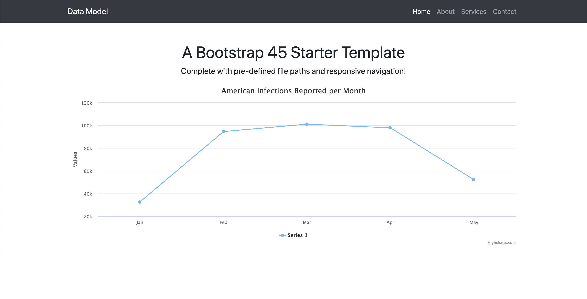

Initially this[https://medium.com/@dushan14/create-a-web-application-with-python-flask-postgresql-and-deploy-on-heroku-243d548335cc] guide was followed for setup.

This app uses flask_sqlalchemy to define the infection model, psycopg to interact with it and flask to build the interface, bootstrap as the theme

source env/bin/activate to go into virtenv
dashboard theme from https://themewagon.com/themes/open-source-bootstrap-admin-template/

progress:

