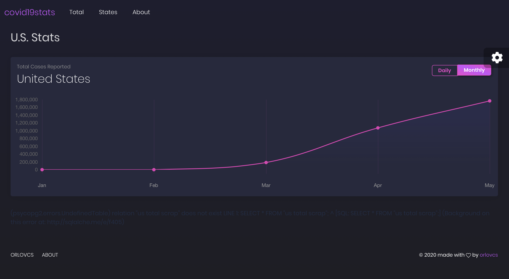

# Dev Progress

Initially a bare bootstrap theme with Highcharts.js was used:

However despite numerous formatting changes, a bug existed where Highcharts.js could not recognize the date in the data properly despite even converting it to UNIX timestamps.

Eventually a new theme was picked since it already contained columns and cards which were going to be used as the states/provinces. Initally the dashboard was kept and the state info was a simple pandas html table.

Eventually shortly after first deployment, a warning was given that the us_infections table maxes out the 10,000 rows available, the code was remodeled to work with less rows.

After adding a search feature, the states were succesfully loading their charts after fixing a bug encountered in states.js where the jQuery handler declared in an array would not recognize each chart.js object. This was fixed by declaring the handlers with this new syntax:  $.each(keys, function( index, value ) {  }).
 

 New cards and info were added.
  
  

Jun 3, 2020

The app was changed so that the unstable driver will not cause the app to crash as it will now only run when the data is updated, the scrapped data will now be stored in a table rather than refreshed on each refresh as this allows for a simple database lookup per instance versus having to load an additional page for every client. Therefore this is not only faster but allows for the app to not be dependant on the seemingly unstable chromedriver. In addition to this, a maximum amount of times to start the driver were added with a try-catch statement to allow for the crash to be caught.

  

June 6, 2020
Support for Docker Compose was added allowing the app to be setup and running with two lines of code.