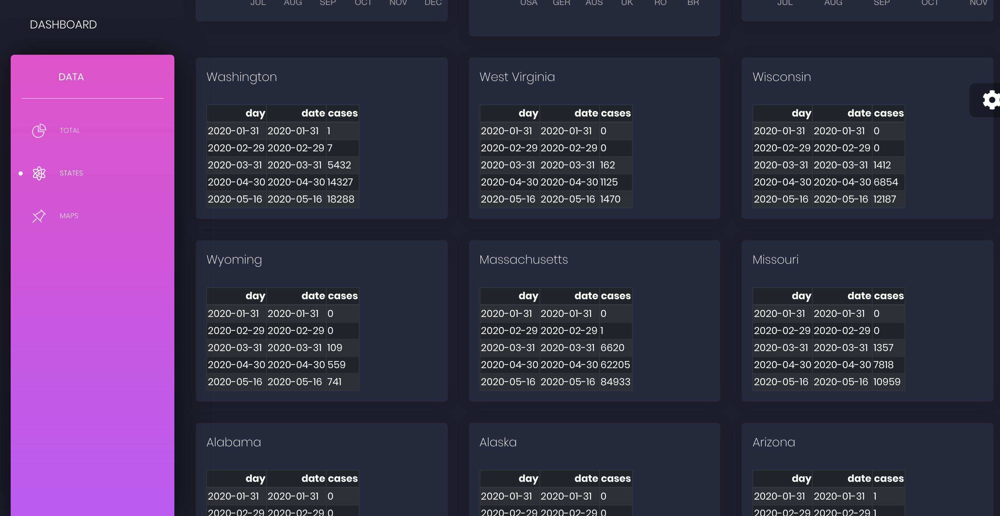
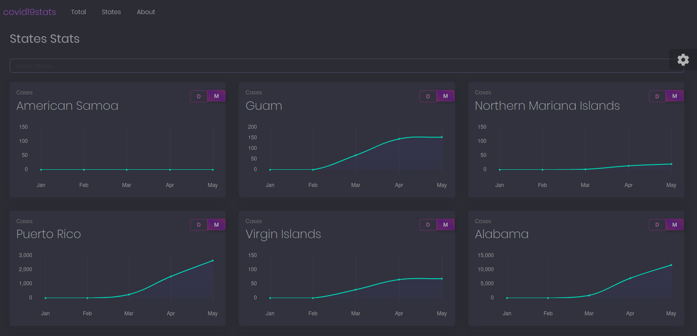
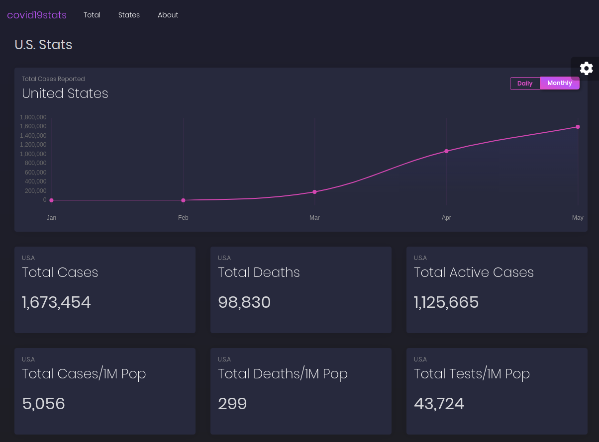

# Dev Progress

Initially a bare bootstrap theme with Highcharts.js was used:

However despite numerous formatting changes, a bug existed where Highcharts.js could not recognize the date in the data properly despite even converting it to UNIX timestamps.

Eventually a new theme was picked since it already contained columns and cards which were going to be used as the states/provinces. Initally the dashboard was kept and the state info was a simple pandas html table.

Eventually shortly after first deployment, a warning was given that the us_infections table maxes out the 10,000 rows available, the code was remodeled to work with less rows.

After adding a search feature, the states were succesfully loading their charts after fixing a bug encountered in states.js where the jQuery handler declared in an array would not recognize each chart.js object. This was fixed by declaring the handlers with this new syntax:  $.each(keys, function( index, value ) {  }).
 

 New cards and info were added.
  
  

